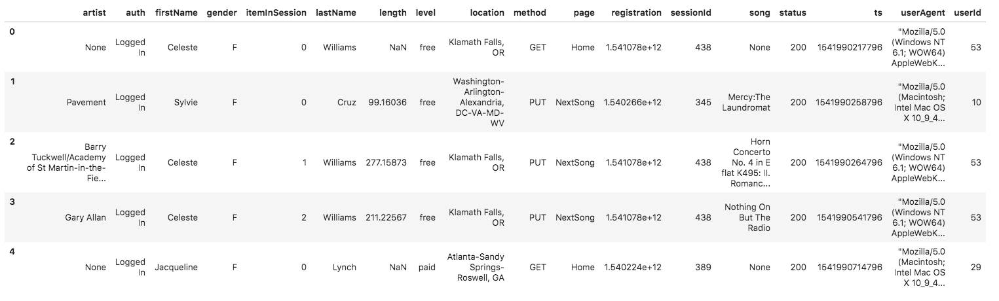

## Udacity Data Engineer Nanodegree
## Data Modeling with Postgres
### Introduction  
A startup called Sparkify wants to analyze the data its been collecting on songs and user activity on their new music streaming app. The analytics team is particularly interested in understanding what songs users are listening to. Currently, Sparkify does not have an easy way to query its data, which resides in a directory of JSON logs of user activity on the app, as well as a directory with JSON metadata on the songs in their app.

The company would like a data engineer to create a Postgres database with tables designed to optimize queries on song play analysis.

### Project Description and Purpose
Using skills learned about data modeling with Postgres and building ETL pipelines with Python, define fact and dimension tables for a star schema, and write an ETL pipeline that transfers data from files in two local directories into Postgres tables using Python and SQL.

After creating a relational database and standing up a reliable ETL pipeline to ingest additional data, Sparkify will be able to systematically store and easily access data associated with its application users and their activity. The data can then be used by the Sparkify analytics team to extract valuable insights related to application users' behaviors that can be leveraged for application enhancements such as song play recommendations.

### Datasets
The **song dataset** is a subset of real data from the [Million Song Dataset](http://millionsongdataset.com/). Each file is in JSON format and contains metadata about a song and the artist of that song. The files are partitioned by the first three letters of each song's track ID. For example, here are filepaths to two files in this dataset.

    song_data/A/B/C/TRABCEI128F424C983.json
    song_data/A/A/B/TRAABJL12903CDCF1A.json

Here is an example of what a single song file, TRAABJL12903CDCF1A.json, looks like.

    {"num_songs": 1, "artist_id": "ARJIE2Y1187B994AB7", "artist_latitude": null, "artist_longitude": null, "artist_location": "", "artist_name": "Line Renaud", "song_id": "SOUPIRU12A6D4FA1E1", "title": "Der Kleine Dompfaff", "duration": 152.92036, "year": 0}

The **log dataset** consists of log files in JSON format generated by this [event simulator](https://github.com/Interana/eventsim) based on the songs in the dataset above. These simulate activity logs from a music streaming app based on specified configurations.

The log files in the dataset are partitioned by year and month. For example, here are filepaths to two files in this dataset.

    log_data/2018/11/2018-11-12-events.json
    log_data/2018/11/2018-11-13-events.json

And below is an example of what the data in a log file, 2018-11-12-events.json, looks like.

### Database Schema
The database is designed using a **star schema** consisting of the following fact and dimension tables. The star schema is appropriate given the simplicity of the data model and the presence of one fact table with accompanying dimension tables. The star schema also supports the stated use case by the Sparkify analytics team to easily query data and quickly output aggregations.

#### Fact Table
**songplays** - records in log data associated with song plays i.e. records with page `NextSong`

| column name | data type | condition   |
| ----------- | --------- | ----------- |
| songplay_id | serial    | primary key |
| start_time  | timestamp | not null    |
| user_id     | int       | not null    |
| level       | varchar   |             |
| song_id     | varchar   |             |
| artist_id   | varchar   |             |
| session_id  | int       | not null    |
| location    | varchar   |             |
| user_agent  | varchar   |             |

#### Dimension Tables  
**users** - users in the app

| column name | data type | condition   |
| ----------- | --------- | ----------- |
| user_id     | int       | primary key |
| first_name  | varchar   |             |
| last_name   | varchar   |             |
| gender      | char      |             |
| level       | varchar   |             |

**songs** - songs in music database  

| column name | data type | condition   |
| ----------- | --------- | ----------- |
| song_id     | varchar   | primary key |
| title       | varchar   | not null    |
| artist_id   | varchar   | not null    |
| year        | int       |             |
| duration    | numeric   |             |

**artists** - artists in music database   

| column name | data type | condition   |
| ----------- | --------- | ----------- |
| artist_id   | varchar   | primary key |
| location    | varchar   |             |
| latitude    | float     |             |
| longitude   | float     |             |

**time** - timestamps of records in `songplays` broken down into specific units

| column name | data type | condition   |
| ----------- | --------- | ----------- |
| start_time  | timestamp | primary key |
| hour        | int       |             |
| day         | int       |             |
| week        | int       |             |
| month       | int       |             |
| year        | int       |             |
| weekday     | int       |             |

### Steps
Below are the steps taken to complete the project:

1. Created Tables  
 - Wrote `CREATE` and `DROP` statements in `sql_queries.py` to create and drop each table for ease of creating and resetting database tables.  
 - Ran `create_tables.py` to create the database and tables.
 - Ran `test.ipynb` to confirm the creation of the tables with the correct columns.

2. Built ETL Processes
 - Followed the instructions in the `etl.ipynb` notebook to develop the skeleton ETL processes for each table.
 - Ran `test.ipynb` to confirm records were successfully entered into each table.

3. Built ETL Pipeline
 - Using `etl.ipynb`, coded all necessary functions in `etl.py` to process all datasets.
 - Confirmed all records were successfully inserted into each table by querying the database.

### Conclusion
By creating a Postgres database and ETL code to ingest new data, Sparkify and its analytics team now have the tools it needs to better understand how its users are interacting with its music streaming app. Because the project is Pythonic and all scripts have been intuitively structured, the Sparkify analytics team will easily be able to provide ongoing code maintenance and enhancements.

### Example Queries
The number of song plays by hour to understand when during the day users are using the app more frequently - app usage appears to peak between 3-6pm.

    select
    t.hour,
    count(distinct sp.songplay_id) as song_plays
    from songplays sp
    join time t on t.start_time = sp.start_time
    group by t.hour
    order by t.hour;

The number of song plays by subscription level - paid subscribers are more active.

    select
    level,
    count(distinct songplay_id) as song_plays
    from songplays
    group by level;

The count of users by gender - there are more female users than male.

    select
    gender,
    count(distinct user_id)
    from users
    group by gender;
